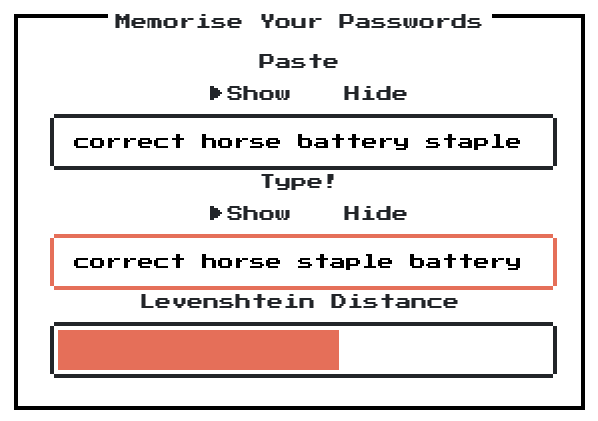

# Memorise
Quick and dirty JavaScript thing to assist with memorising passwords.

https://memorise.lmhd.me

Because even when you use a password manager, there are some passwords its worth remembering.

Don't use it unless you've read and understood the code. And even then...

## Third Party Resources

* Nes.css - https://nostalgic-css.github.io/NES.css/

* Press Start 2p - https://fonts.google.com/specimen/Press+Start+2P - [[Open Font License]](http://scripts.sil.org/cms/scripts/page.php?site_id=nrsi&id=OFL_web)

* Levenshtein - https://rosettacode.org/wiki/Levenshtein_distance#JavaScript

* jQuery - https://jquery.com/

* Icon - https://creativemarket.com/Martz90/6121-Circle-Icons-Full-Pack - [[Creative Market Personal License]](https://creativemarket.com/licenses/general)